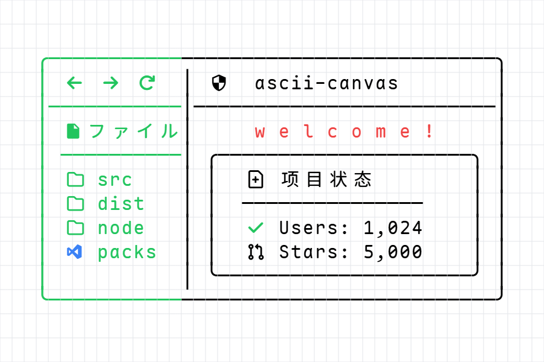
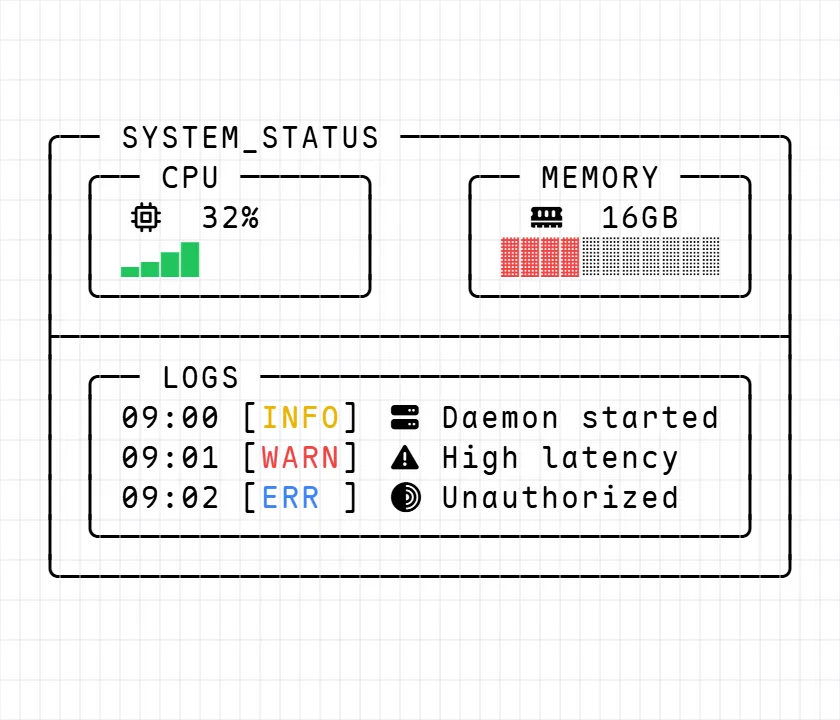
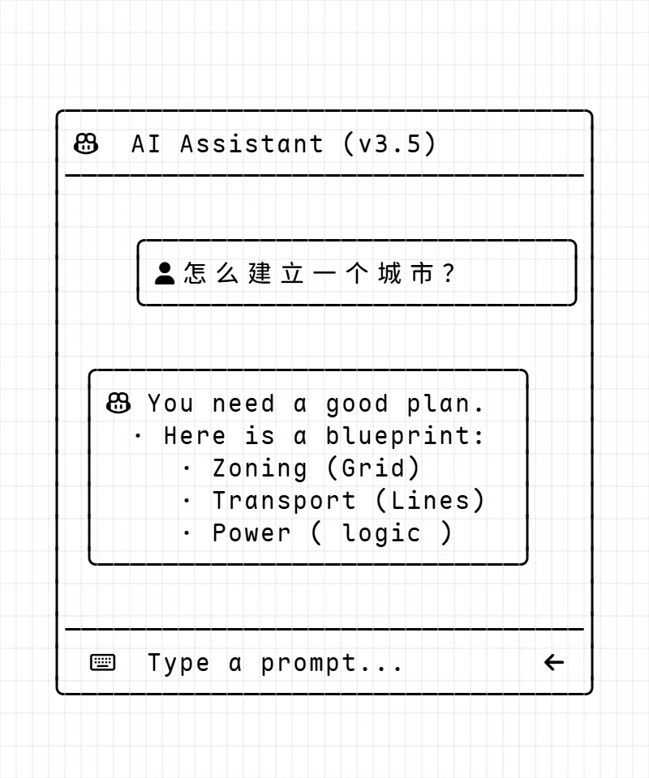
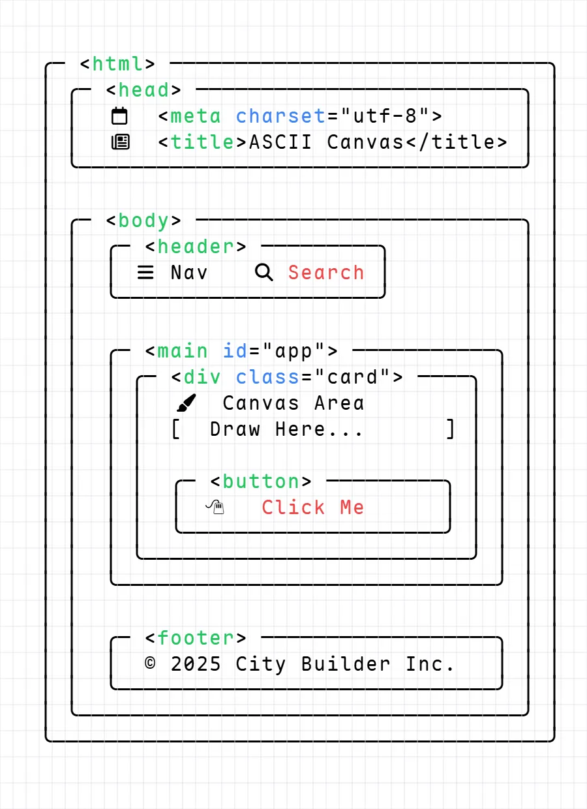
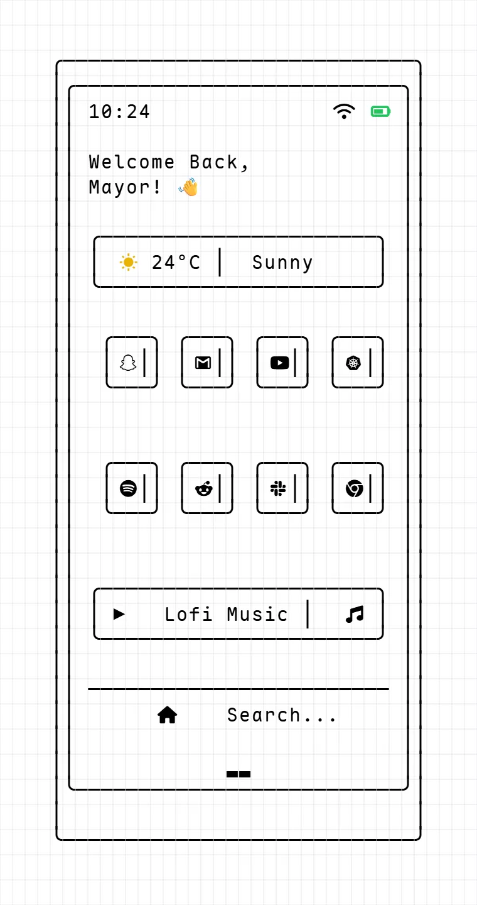

[English](./README.md) | [简体中文]

# ASCII Canvas

[](https://opensource.org/licenses/MIT)
[](https://react.dev/)
[](https://www.typescriptlang.org/)
[](https://yjs.dev/)
[](https://ascii-canvas.pages.dev/)

> **"大模型时代的原生视觉接口：一个支持 CJK、Nerd Fonts 与全色域的无限 ASCII 画布，旨在成为人类与 AI 的共享白板。"**

<br />

<p align="center">
  
</p>

<p align="center">
  <a href="https://ascii-canvas.pages.dev/">
    
  </a>
</p>

---

## 🛠 核心特性

**ASCII Canvas** 是一个高性能、可协作的 ASCII 艺术创作引擎。不同于输出像素（对 LLM 不透明）的传统白板，本引擎渲染的是结构化的、语义清晰的 Unicode 网格。

### 1. 高性能渲染引擎

- **多层画布架构**：采用背景层、草稿层、UI 层分离的三层架构，在复杂操作下依然保持 60FPS 的丝滑体验。
- **无限视口**：集成了屏幕坐标到网格坐标的映射算法，支持无缝的无限平移与缩放。

### 2. 智能排版系统

- **缩进继承**：智能换行逻辑，自动检测并保持上一行的缩进层级。
- **宽字符原生支持**：完美适配 **中日韩 (CJK) 字符**、**Nerd Fonts 图标** 和 **Emoji**，自动修正网格占用。
- **模块化缩进**：专业的 Tab 系统，按 2 个标准网格单位移动光标，对齐更精准。

### 3. 分布式协作

- **Yjs CRDT 集成**：基于无冲突复制数据类型 (CRDT)，实现低延迟的实时多人协作编辑。
- **鲁棒的持久化**：细粒度的撤销/重做 (Undo/Redo) 管理，并支持本地存储同步。

### 4. 精准编辑工具

- **锚点框选**：支持 `Shift + Click` 快速创建以锚点为中心的矩形选区。
- **批量填充**：一键用任意字符填充当前的活跃选区。
- **上下文枢纽**：专业的右键菜单，支持复制、剪切、粘贴和拆除 (删除) 操作。

---

## ✨ 作品展示

<div align="center">
  
  
</div>
<div align="center">
  
  
  
</div>

---

## 🏗 技术栈

- **前端框架**: React 18, TypeScript
- **状态管理**: Zustand (Slice Pattern)
- **同步引擎**: Yjs / Y-IndexedDB
- **手势交互**: @use-gesture/react
- **UI 组件**: Tailwind CSS, Shadcn UI, Radix UI

---

## 🚀 快速开始

### 安装

```bash
git clone https://github.com/Sayhi-bzb/ascii-canvas.git
cd ascii-canvas
npm install
```

### 开发模式

```bash
npm run dev
```

### 构建

```bash
npm run build
```

---

## ⌨️ 快捷键指南

| 操作           | 快捷键         | 说明                                 |
| :------------- | :------------- | :----------------------------------- |
| **框选区域**   | `拖拽`         | 传统的矩形区域选择                   |
| **锚点选区**   | `Shift + 点击` | 创建从上一次点击位置到当前位置的选区 |
| **批量填充**   | `输入字符`     | 用按下的字符填满当前选区             |
| **智能换行**   | `Enter`        | 换行并保留上一行的缩进               |
| **铺设空格**   | `Tab`          | 光标向右移动 2 个网格单位            |
| **上下文菜单** | `右键点击`     | 唤起复制、剪切、粘贴和删除菜单       |

---

## 🗺 路线图 (Roadmap)

- [x] 多层 Canvas 渲染引擎
- [x] 基于 Yjs 的实时协作
- [x] 智能缩进与 Tab 系统
- [x] 右键菜单与剪贴板集成
- [ ] **NES (Next Edit Suggestion)**: 基于布局模式的字符预测
- [ ] **AI Chat 集成**: 通过自然语言生成画布组件
- [ ] 支持 ANSI 序列与 SVG 导出

---

## 📄 许可证

本项目基于 **MIT 许可证** 开源。详情请参阅 [LICENSE](LICENSE) 文件。
